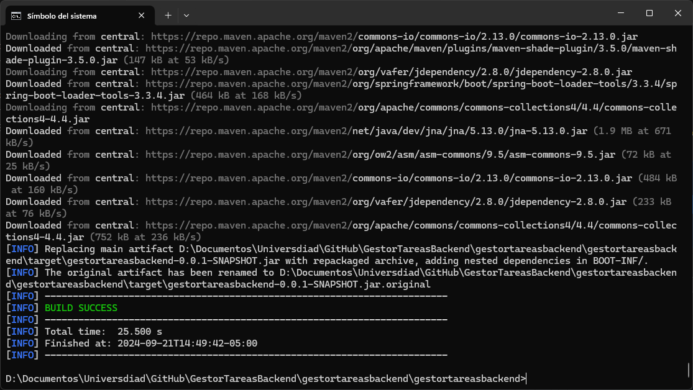
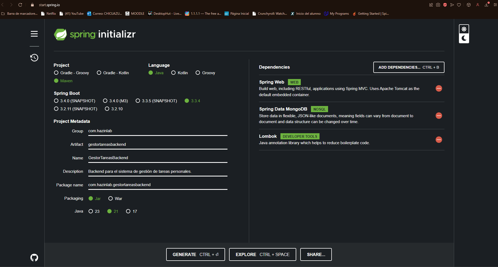
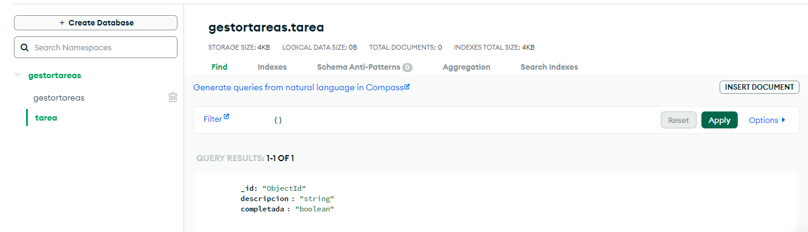
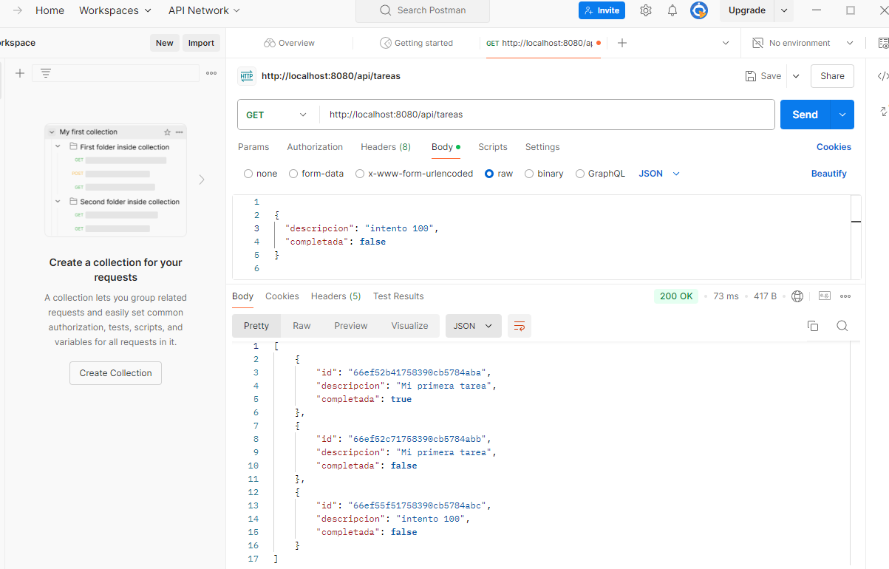
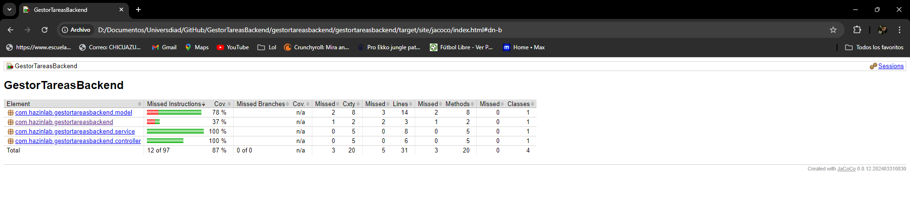

# GestorTareasBackend

Se compila luego de programar el spring boot

Se creo la base de datos en mongo siendo la unica tabla la de tarea la cual tiene un id, descripcion y completar

ahora descargamos postman para hacer el tema de solicitudes, y realizamos varias locitudes de tipo get y post

ademas hacemos una de completar una tarea en especifico
http://localhost:8080/api/tareas/66ef52b41758390cb5784aba/completar

--Se cubre el 87% en cuanto a pruebas

a